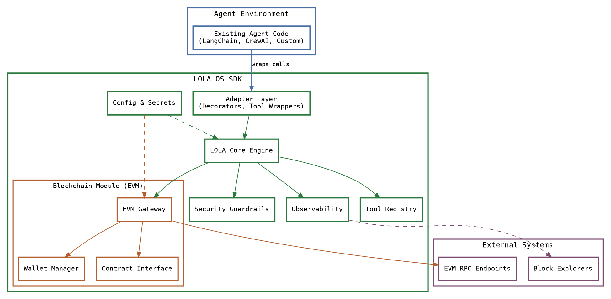
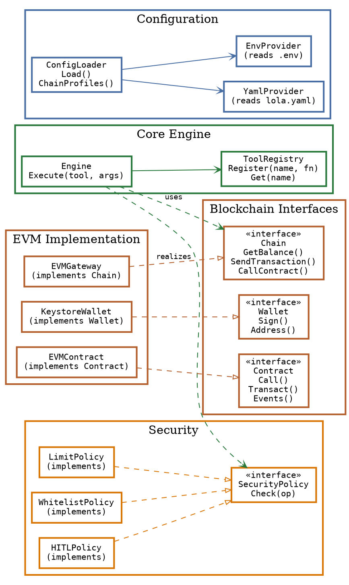
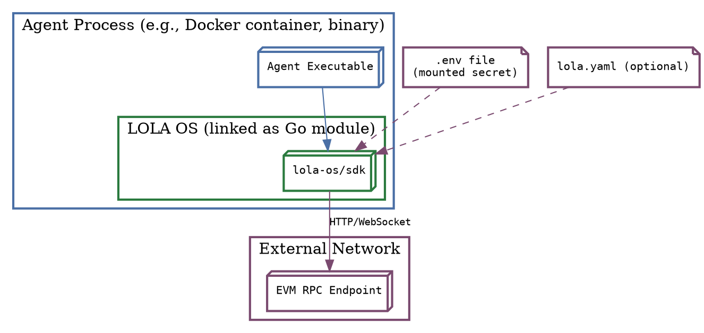
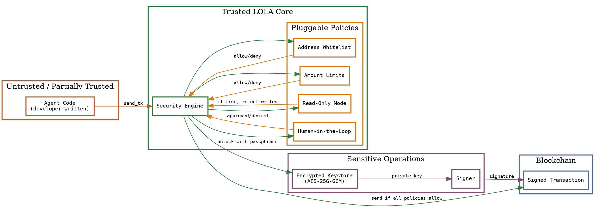
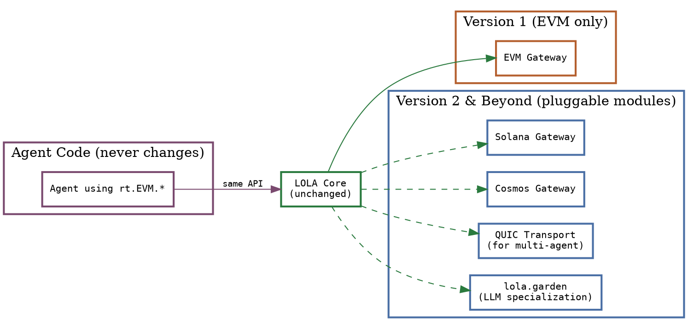

# LOLA OS Architecture

**Version:** 1.0-alpha  
**Date:** February 12, 2026  
**Author:** Levi Chinecherem Chidi (0xSemantic)  
**Document:** Architecture & System Design

---

## 1. Introduction

LOLA OS is a **modular, extensible systems infrastructure** that transforms any AI agent into a blockchain‑native agent with full read/write capabilities across EVM chains. This document describes the **system architecture** at multiple levels of abstraction: from the high‑level structural decomposition down to data flows, integration patterns, and future extension points.

All diagrams adhere to a **border‑only styling** philosophy: no background fills, only colored borders and labels. This reflects the maturity and precision of the architecture—nothing is decorative, everything carries meaning.

---

## 2. High‑Level System Architecture

The system is organized into **three concentric layers**: the **Agent Environment** (unmodified), the **LOLA OS SDK** (our core), and **External Systems** (blockchain networks, explorers, etc.). Each layer communicates through well‑defined interfaces.



**Explanation:**  
The **Agent Environment** is completely unchanged; the developer only adds a thin **Adapter Layer** that intercepts agent actions and routes them into LOLA OS. The **LOLA Core Engine** orchestrates all operations: it resolves tools from the **Tool Registry**, checks **Security Guardrails**, and dispatches calls to the appropriate blockchain module. The **EVM Gateway** encapsulates all EVM‑specific logic—RPC communication, transaction construction, signing via the **Wallet Manager**, and contract interactions. **Configuration & Secrets** are injected at startup; **Observability** emits structured logs and metrics. All external communication (RPC, block explorers) is abstracted behind interfaces, enabling future replacements.

---

## 3. Component Architecture & Interface Contracts

Every major component is defined by a **strict interface**. This design ensures that implementations can be swapped, mocked, or extended without modifying dependent code.



**Explanation:**  
The **Core Engine** depends only on the **interfaces** `Chain`, `Wallet`, `Contract`, `ToolRegistry`, and `SecurityPolicy`. This is Dependency Inversion at its purest. The **EVM implementation** provides concrete realizations of those interfaces; in the future, a Solana implementation would simply provide another set of realizations. **Security policies** are also pluggable—developers can compose multiple policies or write their own. **Configuration** is abstracted behind a `ConfigLoader` that can source data from environment variables, YAML files, or any future provider.

---

## 4. Agent Integration Flowchart

The following flowchart illustrates how an existing agent is **onboarded** to use LOLA OS with minimal code changes.

```mermaid
flowchart TD
    Start([Developer decides to add onchain capability]) --> Step1[Import lola-go-sdk]
    Step1 --> Step2{Has .env file?}
    
    Step2 -- No --> Step3[Copy .env.example, add RPC URL & private key (optional)]
    Step3 --> Step4
    Step2 -- Yes --> Step4[Initialize LOLA runtime: rt := lola.Init()]
    
    Step4 --> Step5{Agent needs custom onchain tools?}
    Step5 -- Yes --> Step6[Write Go function, register: lola.RegisterTool(\"name\", fn)]
    Step6 --> Step7
    Step5 -- No --> Step7[Wrap agent logic in rt.Run()]
    
    Step7 --> Step8[Inside rt.Run, use rt.EVM methods or rt.Execute]
    Step8 --> Step9[Test agent locally]
    Step9 --> Step10{Works as expected?}
    Step10 -- No --> Step11[Adjust security policies, RPC endpoints, gas settings]
    Step11 --> Step8
    Step10 -- Yes --> Step12[Deploy agent to production]
    Step12 --> End([Agent now blockchain-native])
```

**Explanation:**  
The integration path is deliberately short. The developer **imports** the SDK, **initializes** the runtime (which automatically reads `.env`), optionally **registers custom tools**, and then **wraps** their existing agent logic inside `rt.Run()`. Inside the closure, they gain access to all EVM capabilities. This flow can be completed in under an hour, even for developers new to blockchain.

---

## 5. Data Flow During an Onchain Transaction

This diagram traces the journey of a **transaction submission** from agent call to blockchain confirmation.

```mermaid
flowchart LR
    subgraph Agent_Code [Agent Code]
        A[Agent calls rt.EVM.SendTransaction]
    end
    
    subgraph LOLA_Core [LOLA Core]
        B[Engine.Execute receives tool 'SendTransaction']
        C[Security Guardrails: check limits, whitelist, HITL]
        D[EVMGateway.SendTransaction]
    end
    
    subgraph EVM_Module [EVM Module]
        E[Build transaction object]
        F[Estimate gas]
        G[Sign with Wallet]
        H[Broadcast via RPC client]
        I[Wait for receipt (poll or subscription)]
    end
    
    subgraph External [External]
        J[EVM RPC endpoint]
        K[Blockchain network]
    end
    
    A --> B
    B --> C
    C -- Approved --> D
    D --> E
    E --> F
    F --> G
    G --> H
    H --> J
    J --> K
    K -- receipt --> I
    I -- tx hash --> D
    D -- result --> B
    B -- return --> A
    
    style Agent_Code stroke-width:2px,stroke:#4a6fa5,fill:none
    style LOLA_Core stroke-width:2px,stroke:#2a7a3e,fill:none
    style EVM_Module stroke-width:2px,stroke:#b45f2e,fill:none
    style External stroke-width:2px,stroke:#7a4a6f,fill:none
```

**Explanation:**  
The agent’s high‑level call is transformed into a **tool execution** in the Core Engine. Security policies are evaluated **before** any blockchain interaction—if a policy requires human approval, the call blocks until consent is received. The EVM Gateway then constructs, signs, and broadcasts the transaction. The RPC layer implements **automatic retries** with exponential backoff and handles transient network errors. Once the transaction is confirmed (configurable number of blocks), the hash and receipt are returned up the stack. Every step is logged with a correlation ID.

---

## 6. Developer User Flow (Onboarding Experience)

This user flow emphasizes the **simplicity** and **progressive disclosure** of complexity.

```mermaid
flowchart TD
    U1[Developer hears about LOLA OS] --> U2[Reads \"Get Started in One Evening\"]
    U2 --> U3[Installs: go get github.com/lola-os/sdk]
    U3 --> U4[Creates main.go with 10-line balance checker]
    U4 --> U5[Copies .env.example to .env, adds Infura RPC]
    U5 --> U6[go run main.go]
    U6 --> U7{Sees balance output?}
    
    U7 -- Yes --> U8[Adds transaction: modifies code to send 0.001 ETH]
    U8 --> U9{Needs private key?}
    U9 -- Yes --> U10[Adds ETH_PRIVATE_KEY to .env]
    U10 --> U11[Runs again, sees tx hash]
    U11 --> U12[Success: agent can now transact]
    
    U7 -- No --> U13[Checks error: invalid RPC? missing env?]
    U13 --> U6
    
    U12 --> U14[Adds custom tool: swap on Uniswap]
    U14 --> U15[Registers tool, calls rt.Execute]
    U15 --> U16[Agent now swaps tokens]
    U16 --> U17[Configures daily limit in lola.yaml]
    U17 --> U18[Deploys to production]
    
    style U1 stroke-width:2px,stroke:#4a6fa5,fill:none
    style U2 stroke-width:2px,stroke:#4a6fa5,fill:none
    style U3 stroke-width:2px,stroke:#2a7a3e,fill:none
    style U4 stroke-width:2px,stroke:#2a7a3e,fill:none
    style U5 stroke-width:2px,stroke:#4a6fa5,fill:none
    style U6 stroke-width:2px,stroke:#2a7a3e,fill:none
```

**Explanation:**  
The user flow is intentionally **flat**—there are no deep prerequisite chains. The developer goes from zero to a working transaction in less than 10 minutes. Complexity (custom tools, advanced policies, configuration files) is introduced **only when the developer seeks it**. This aligns with the “one evening mastery” goal.

---

## 7. Deployment Architecture

LOLA OS is **embedded** inside the agent’s own process. There is no separate service or daemon (in V1). This diagram shows the deployment context.



**Explanation:**  
LOLA OS is **compiled directly into the agent binary** via standard Go module imports. No sidecars, no external orchestrators. Configuration is supplied via environment variables (mounted as secrets in container environments) and optional YAML files. The agent communicates directly with EVM RPC endpoints. This architecture minimizes latency, reduces operational complexity, and preserves the agent’s existing deployment model.

---

## 8. Security Architecture

Security is not a single component—it is **woven into every interface**. This diagram illustrates the security boundaries and the path of a transaction through the guardrails.



**Explanation:**  
All agent‑initiated write operations pass through the **Security Engine**, which evaluates a **chain of policies**. Each policy independently returns an `allow`/`deny` decision; the engine requires **all policies to allow** the operation. Critical secrets (private keys) never enter the agent’s memory space unencrypted; they are held in an **encrypted keystore** and only decrypted momentarily inside the `Signer` component. Human‑in‑the‑loop policies can **pause execution** and request approval via the console or an external API.

---

## 9. Modularity & Plugin Architecture

LOLA OS is designed to be **infinitely extensible**. The following diagram shows how new chain implementations, security policies, or configuration sources can be **plugged in** without altering the core.

```dot
digraph LOLA_Plugins {
    rankdir=TB;
    node [shape=box, style="solid", penwidth=2, fontname="Courier", fontsize=10];
    edge [fontname="Courier", fontsize=9];
    
    Core [label = "LOLA Core\n(Engine, ToolRegistry)", color = "#2a7a3e", penwidth=2];
    
    subgraph cluster_chain_plugins {
        label = "Chain Implementations (pluggable)";
        labelloc = t;
        color = "#b45f2e";
        penwidth = 2;
        style = "solid";
        
        EVM [label = "EVM Gateway\n(V1 built-in)", color = "#b45f2e"];
        Solana [label = "Solana Gateway\n(plugin, post-V1)", color = "#b45f2e", style = "dashed"];
        Cosmos [label = "Cosmos Gateway\n(plugin, post-V1)", color = "#b45f2e", style = "dashed"];
    }
    
    subgraph cluster_policy_plugins {
        label = "Security Policies (pluggable)";
        labelloc = t;
        color = "#d97706";
        penwidth = 2;
        style = "solid";
        
        BuiltinPolicies [label = "Limit, Whitelist, HITL, ReadOnly", color = "#d97706"];
        CustomPolicy [label = "Custom Policy\n(e.g., ML-based anomaly)", color = "#d97706", style = "dashed"];
    }
    
    subgraph cluster_config_plugins {
        label = "Configuration Providers (pluggable)";
        labelloc = t;
        color = "#4a6fa5";
        penwidth = 2;
        style = "solid";
        
        Env [label = "Environment Variables", color = "#4a6fa5"];
        Yaml [label = "YAML File", color = "#4a6fa5"];
        Consul [label = "Consul / etcd\n(plugin)", color = "#4a6fa5", style = "dashed"];
    }
    
    subgraph cluster_tool_plugins {
        label = "Tool Definitions (user‑supplied)";
        labelloc = t;
        color = "#7a4a6f";
        penwidth = 2;
        style = "solid";
        
        UserTool1 [label = "swap()", color = "#7a4a6f"];
        UserTool2 [label = "lend()", color = "#7a4a6f"];
    }
    
    Core -> EVM [color = "#2a7a3e", label = "uses Chain"];
    Core -> Solana [color = "#2a7a3e", style = "dashed", label = "future"];
    Core -> Cosmos [color = "#2a7a3e", style = "dashed", label = "future"];
    Core -> BuiltinPolicies [color = "#2a7a3e"];
    Core -> CustomPolicy [color = "#2a7a3e", style = "dashed"];
    Core -> Env [color = "#2a7a3e", style = "dashed", label = "reads config"];
    Core -> Yaml [color = "#2a7a3e", style = "dashed"];
    Core -> Consul [color = "#2a7a3e", style = "dashed"];
    Core -> UserTool1 [color = "#2a7a3e", label = "registers"];
    Core -> UserTool2 [color = "#2a7a3e", label = "registers"];
}
```



**Explanation:**  
The Core depends **only on interfaces**. All concrete implementations—whether they are built‑in (EVM, built‑in policies) or third‑party plugins (Solana, Consul, custom policies)—are injected at runtime or compile time. This architecture guarantees that **no future feature will require a breaking change** in the Core. It also enables a rich ecosystem of community‑contributed adapters.

---

## 10. Future Extensions Architecture

While Version 1 alpha focuses solely on EVM, the architecture is **already laid out** to accommodate non‑EVM chains, advanced networking, and the `lola.garden` LLM specialization module.



**Explanation:**  
The **same agent code** that calls `rt.EVM.GetBalance()` today will, in the future, be able to call `rt.Solana.GetBalance()` if the developer simply adds the Solana plugin and changes the chain name. More importantly, the **Core does not change**—new capabilities are added as separate modules that register themselves with the Core. This is the hallmark of a **sustainable, long‑lived infrastructure** platform.

---

## 11. Conclusion

The LOLA OS architecture is the result of **deliberate, principled design**:

- **Modularity** is not an afterthought; it is the foundation.
- **Simplicity** for the developer is achieved through powerful, well‑factored internals.
- **Future‑proofing** is baked into every interface, ensuring that the system can grow without breaking existing agents.
- **Ownership‑grade** engineering means that every component is observable, testable, and replaceable.

This architecture is ready for **Version 1 alpha**, and equally ready for the decade of evolution that will follow.

---

*End of Architecture Document*